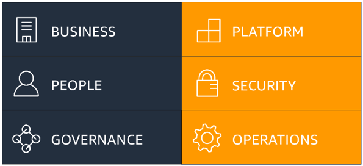

# 1.3 AWS Cloud Migration Strategies

### 1. AWS Cloud Adoption Framework (CAF)

The AWS Cloud Adoption Framework (CAF) helps organizations **prepare, plan, and execute** their migration to the AWS Cloud.  
It provides structured guidance to adopt the cloud in alignment with **business goals**.

---

### CAF Perspectives

#### Business
Focuses on business value and outcomes.

Key aspects:
- Value creation
- Business goals
- Financial benefits

---

#### People
Focuses on people, skills, and organizational change.

Key aspects:
- Skills and training
- Roles and responsibilities
- Organizational readiness

---

#### Governance
Focuses on control, compliance, and risk management.

Key aspects:
- Policies and standards
- Cost control
- Compliance and risk management

---

#### Platform
Focuses on infrastructure and cloud services.

Key aspects:
- Cloud infrastructure
- Networking and services
- Platform architecture

---

#### Security
Focuses on protection and risk mitigation.

Key aspects:
- Data protection
- Identity and access management
- Risk management

---

#### Operations
Focuses on day-to-day operations.

Key aspects:
- Monitoring and logging
- Incident management
- Operational processes

---

### Benefits of Cloud Adoption Using CAF

Organizations adopting AWS using CAF can achieve:

- **Reduced commercial risk**
 Redusk risk profile, it gives more secuiriy and eficiency
- **Improved environmental, social, and governance (ESG):**
  - Transparency in a enterprice level, by having information easily
- **Increased revenue by:**
  - Creating new products and services
  - Reaching new customers
- **Improved operational efficiency by:**
  - Reducing operational costs
  - Increasing productivity
  - Enhancing customer and employee experience

---

## 2. Cloud Adoption Journey

Typical stages of cloud adoption in an organization:

1. **Project**
   - Initial cloud projects
   - AWS evaluation

2. **Foundation**
   - Establishing cloud foundations
   - Account setup and governance

3. **First Workload**
   - Deploying the first application in AWS

4. **Landing Zone**
   - Creating a secure and scalable environment
   - Networking, security, and accounts

5. **Migration**
   - Migrating existing workloads to AWS

6. **Cloud Center of Excellence (CCoE)**
   - Centralized team for cloud best practices and governance

7. **Long-Term Cloud Operations**
   - Optimized and stable cloud operations

8. **Reinvention**
   - Modernizing applications
   - New cloud-native architectures

9. **Cloud-First Strategy**
   - All new applications start in AWS

---

## 3. AWS Migration Strategies – The 7 Rs

AWS defines seven common migration strategies known as the **7 Rs**.

---

### Retire
- Turn off applications that are no longer needed
- Reduce costs by eliminating unused workloads

---

### Retain
- Keep applications on-premises
- Typically due to compliance, latency, or business constraints

---

### Rehost (Lift and Shift)
- Move applications to AWS **without changes**
- Fastest migration approach

---

### Relocate
- Move multiple servers or virtual machines together
- Minimal changes, often using virtualization tools

---

### Repurchase
- Replace existing applications with SaaS solutions
- Example: moving from a self-managed CRM to a cloud-based CRM

---

### Replatform
- Make small optimizations for AWS
- No major architectural changes

---

### Refactor / Rearchitect
- Redesign applications to be cloud-native
- Highest effort, highest long-term benefit
