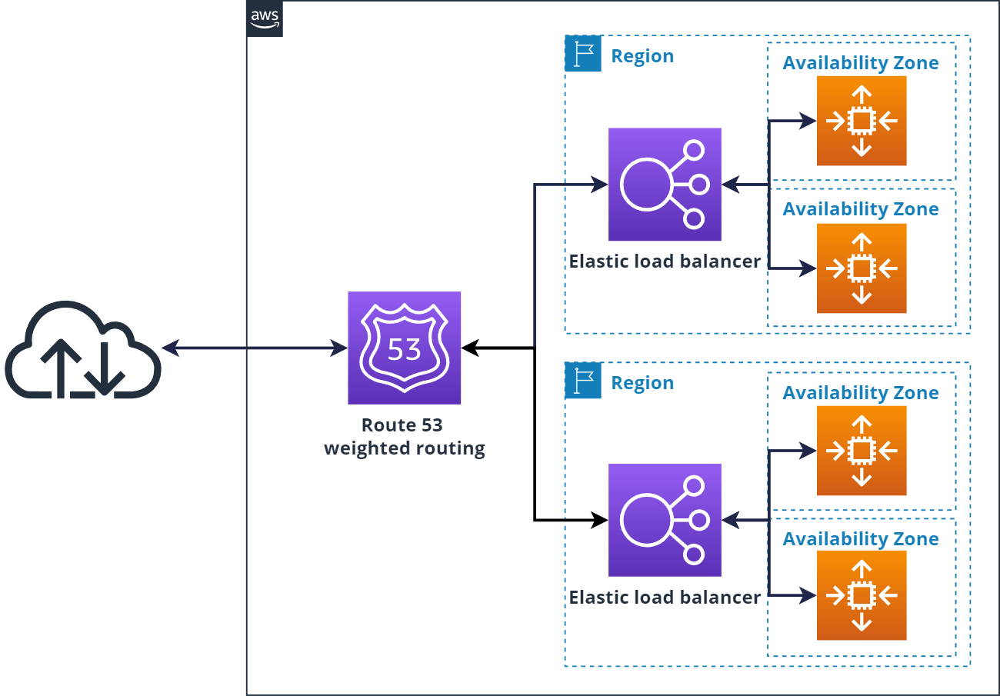

# AWS Regions and Availability Zones

## Regions
***Definition: An AWS Region is a physical location around the world where AWS clusters data centers.***

### how to select a Region:
- Cost: Prices for AWS services can vary by region.
- Latency: Choose a region closer to your users to reduce latency.
- Compliance: Some regions may have specific compliance requirements.
- Services Availability: Not all AWS services are available in every region.

## Availability Zones (AZs)
***Definition: An Availability Zone (AZ) is a distinct location within an AWS Region that is engineered to be isolated from failures in other AZs.***

## High Availability:
High availability is key to achieve accesibility. By deploying applications across multiple AZs, you can ensure that your applications remain available even if one AZ experiences an outage.

This garanties redoundancy so that if one data center goes down, the others can take over.

  