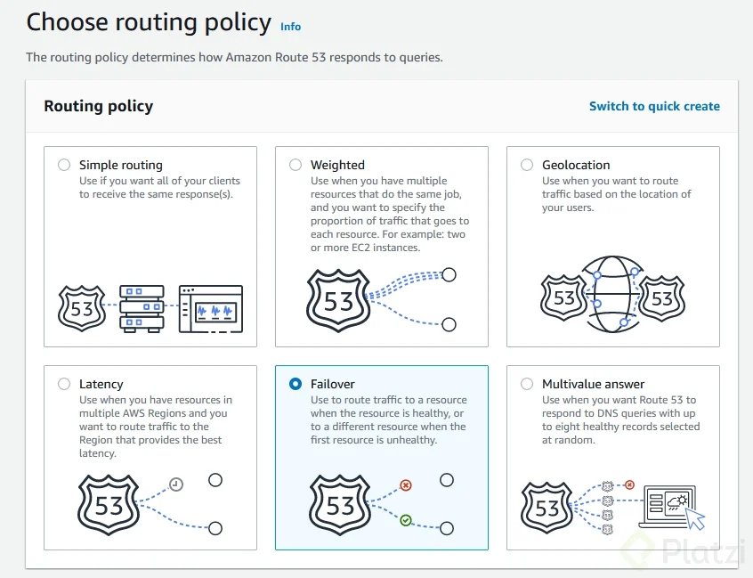

# Route 53
AWS Route 53 is a service that provides DNS (Domain Name System) functionality, allowing you to route end-user requests to your applications hosted on AWS or elsewhere.

## Key Features of Route 53
- **Domain Registration**: You can register new domain names directly through Route 53.

  

routing policies to control how requests are routed to your resources based on factors like latency, geography, and health of resources.

- **Simple routing:** Routes traffic to a single resource.
- **Weighted routing:** Distributes traffic across multiple resources based on assigned weights. 30% traffic to resource A and 70% to resource B.
- **geolocation routing:** Routes traffic based on the geographic location of the user.
- **latency-based routing:** Routes traffic to the resource with the lowest latency for the user.
- **failover routing:** Automatically routes traffic to a healthy resource if the primary resource becomes unavailable.
- **multi-value answer routing:** Returns multiple IP addresses in response to DNS queries, allowing for simple load balancing and increased availability.