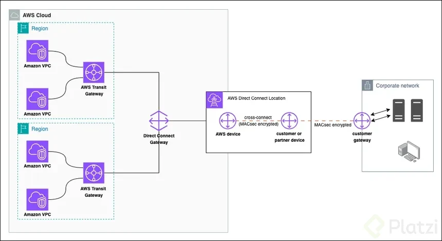
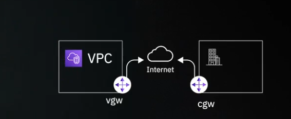

# Conectivity

## 1. Virtual Private Network (VPN)
***Definition: A Virtual Private Network (VPN) extends a private network across a public network, enabling users to send and receive data as if their devices were directly connected to the private network.***
- Secure connection over the internet.
- Encryption of data in transit.
- Commonly used for remote access to corporate networks.
  

 
### 1. Customers Gateway
A Customer Gateway is a physical or software appliance on the customer side of a VPN connection that provides the customer end of the VPN tunnel.
- Fortinet
- SonicWall
- Cisco
- Palo alto

### 2. Virtual Private Gateway
A Virtual Private Gateway is a logical, fully redundant distributed edge routing function that sits at the edge of your VPC and enables connectivity between your VPC and your on-premises network via a VPN
## 2. AWS Direct Connect (DX)
AWS Direct Connect is a service that provides a dedicated network connection from your premises to AWS. It offers a more consistent network experience than using the internet, with lower latency and higher bandwidth.
- Dedicated connection to AWS.
- Lower latency and higher bandwidth compared to internet connections.
- Ideal for high-throughput applications and data transfer.

