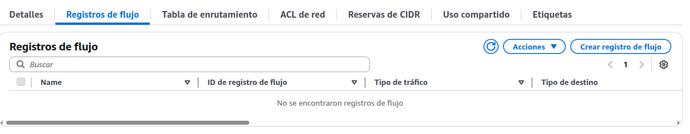

# Confusing Questions 7

## Question 122 

Question: 122. Which of the following is available to a company that has an AWS Business Support plan?
Options:

- A. AWS concierge support
- B. AWS DDoS Response Team (DRT)
- C. AWS Technical Account Manager (TAM)
- D. AWS Health API

Response: D
> The AWS Health API is available to customers with an AWS Business Support plan. It provides programmatic access to the AWS Health Dashboard, allowing users to integrate health information into their own applications and workflows.

Explanation: The AWS Health API provides programmatic access to AWS Health information that is presented in the AWS Personal Health Dashboard. It can help users get timely and personalized information about events that can affect the availability and performance of their AWS resources.

## Question: 147. 

In which categories does AWS Trusted Advisor provide recommended actions? (Select TWO.)
Options:

- A. Operating system patches
- B. Cost optimization
- C. Repetitive tasks
- D. Service quotas
- E. Account activity logs
> Correct answer B. Cost optimization,D. Service quotas

Explanation: AWS Trusted Advisor is a service that provides real-time guidance to help you provision your resources following AWS best practices. Trusted Advisor provides recommended actions in five categories: cost optimization, performance, security, fault tolerance, and service quotas.

## Question: 55. 

What is a cost efficiency principle related to the AWS cloud?
Options:

- A. Properly size services based on capacity needs
- B. Use the Billing Dashboard to access monthly account information
- C. Use AWS Organizations to combine the expenses of multiple accounts into a single invoice
- D. Tag all AWS resources
>Correct answer A. Properly size services based on capacity needs

Explanation: One of the cost efficiency principles related to the AWS cloud is to properly size services based on capacity needs. This means choosing the most appropriate type and size of AWS resources to meet the performance and scalability requirements of applications, avoiding over-provisioning or under-provisioning.

## Question: 22. 

Which AWS service or feature is used for troubleshooting network connectivity between Amazon EC2 instances?
Options:

- A. AWS Certificate Manager (ACM)
- B. Internet Gateway
- C. VPC Flow Logs
- D. AWS CloudHSM
> Correct answer C. VPC Flow Logs

Explanation: VPC Flow Logs enables users to capture information about the IP traffic flowing to and from network interfaces in their VPC, aiding in troubleshooting network connectivity between Amazon EC2 instances.

## Question: 178.
 Which tasks are customer responsibilities, according to the AWS Shared Responsibility Model? (Select TWO.)
Options:

A. Configure the AWS-provided security group firewall.
B. Classify the company's assets on the AWS cloud.
C. Determine which Availability Zones to use for Amazon S3 buckets.
D. Patch or update Amazon DynamoDB.
E. Select Amazon EC2 instances to run AWS Lambda.
F. AWS Config
Correct answer 
>A. Configure the AWS-provided security group firewall.,
> B. Classify the company's assets on the AWS cloud.

Explanation: According to the AWS Shared Responsibility Model, the customer is responsible for security in the cloud, which includes the tasks of configuring the AWS-provided security group firewall and classifying the company's assets on the AWS cloud.

## Question: 194. 
Which AWS service or feature allows users to encrypt data at rest in Amazon S3?
Options:

- A. IAM policies
- B. Server-side encryption
- C. Amazon GuardDuty
- D. Client-side encryption

> Correct answer B. Server-side encryption

Explanation: Server-side encryption is an encryption option that Amazon S3 provides to encrypt data at rest in Amazon S3. With server-side encryption, Amazon S3 encrypts an object before saving it to disk in its data centers and decrypts it when you download the objects.

## Question: 52.

 Which AWS service should a cloud engineer use to visualize API calls to AWS services?
Options:

- A. Amazon CloudWatch
- B. AWS CloudTrail
- C. AWS Config
- D. AWS Artifact

> Correct answer B. AWS CloudTrail

Explanation: AWS CloudTrail is a service that provides a history of AWS API calls for your AWS account, allowing users to audit and review account activity.