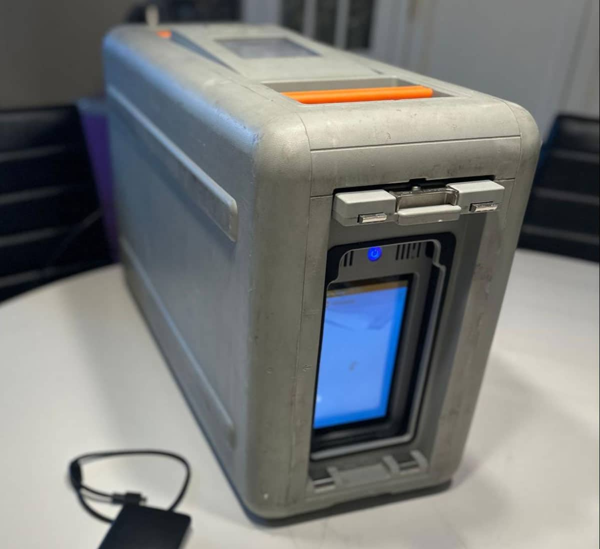

# Services

## AWS Migration Tools

| Tool | What is it? | Best Use Cases |
|-----|------------|---------------|
| **AWS Database Migration Service (AWS DMS)** | Managed service that migrates databases to AWS and replicates changes in real time while the source database remains operational. | - Database migrations - Continuous data changes - Minimal downtime - Gradual migrations |
| **AWS Application Migration Service (AWS MGN)**  | Service to migrate entire servers (OS + applications) to AWS by installing an agent on the source server. | - Full application migrations - No refactoring required - Physical servers or VMs - Fast migrations |

## AWS Snow Family

| Service | Capacity | Typical Use |
|------|---------|-------------|
| **Snowcone** | Up to 8 TB | Small-scale data transfer, edge computing |
| **Snowball** | Tens of TBs to PBs | Large-scale offline data transfer |
| **Snowmobile** | Exabytes | Extremely large data migrations |

## Online Data Transfer Options

| Method | Description |
|------|------------|
| **AWS DataSync**  | Accelerates online data transfers to S3, EFS, and FSx |
| **rsync** | Faster file synchronization over the network |

## AWS Database Services

| Database | Best For | SQL / NoSQL | Description |
|--------|---------|------------|-------------|
| **Amazon Aurora**  | High-traffic, mission-critical applications | **SQL** | Cloud-native relational database compatible with MySQL and PostgreSQL, optimized by AWS for performance and availability |
| **Amazon DynamoDB** | Massive scale and serverless workloads | **NoSQL** (Key-Value / Document) | Fully managed NoSQL database with fast, predictable performance and automatic scaling |
| **Amazon RDS**  | Traditional applications | **SQL** | Managed relational database supporting MySQL, PostgreSQL, Oracle, SQL Server, and MariaDB |
| **Amazon Neptune** | Complex relationships | **NoSQL (Graph)** | Graph database optimized for highly connected data |
| **Amazon Redshift** | Analytics and BI | **OLAP** | Data warehouse designed for analytics, reporting, and big data workloads |

## Security Controls

| Service | Purpose | How it Works | Pricing |
|-------|--------|-------------|--------|
| **Amazon GuardDuty**  | Detects threats in AWS accounts | Analyzes CloudTrail logs, VPC Flow Logs, and DNS logs to detect malicious activity (compromised credentials, malicious IPs, anomalous EC2 behavior) | Pay as you go based on logs analyzed |
| **AWS Artifact**  | Access compliance and audit documentation | Portal that provides audit reports, certifications, and compliance standards (ISO, GDPR, SOC) | Free (included with AWS account) |
| **AWS Shield** | Protects against DDoS attacks | Automatically detects and mitigates DDoS attacks. Two levels: Standard and Advanced | Shield Standard: Free Shield Advanced: High fixed monthly cost |
| **AWS WAF** | Web application firewall | Filters HTTP HTTPS traffic using rules to block SQL injection, XSS, and malicious requests | Pay as you go based on rules and requests inspected |
| **AWS Inspector** | Vulnerability scanning | Scans EC2 instances, container images, and workloads for CVEs and insecure configurations | Pay as you go based on resources scanned |
| **AWS Security Hub** | Centralized security view | Aggregates findings from GuardDuty, Inspector, Config, and others into a single dashboard | Pay as you go based on checks and findings |
| **AWS Trusted Advisor** | Security recommendations | Provides best-practice recommendations but does not enforce controls | Included (basic checks free) |
| **AWS Marketplace** | Third-party security tools | Marketplace to find and deploy third-party security software | Varies by vendor |

## Network Security Controls

| Control | Description |
|-------|-------------|
| **Network ACLs** | Stateless, can explicitly deny traffic from IP ranges |
| **Security Groups** | Stateful, cannot explicitly deny traffic; inbound traffic automatically allows outbound response |

## Access Control Services

| Service | Purpose | How it Works | Pricing |
|-------|--------|-------------|--------|
| **Amazon IAM** | Manage access to AWS resources | Users, roles, policies, and permissions | Free |
| **AWS Cognito** | User authentication | User directory, authentication, social login, temporary credentials | Pay as you go |

## Logging, Audit, and Monitoring

| Service | Purpose | How it Works | Pricing |
|-------|--------|-------------|--------|
| **Amazon CloudWatch** | Monitor performance and health | Collects metrics, logs, alarms, dashboards, and sends alerts | Basic metrics free; logs, custom metrics, alarms pay as you go |
| **AWS CloudTrail** | Track account activity | Records who did what, when, and from where; stores logs in S3; multi-region | Management events free; data events pay as you go |
| **AWS Config** | Track configuration changes | Records resource configurations, detects changes, evaluates compliance | Pay as you go based on resources and rules |
| **AWS Audit Manager** | Prepare audit evidence | Collects data from CloudTrail, Config, and other services; generates audit reports | Pay as you go based on assessments |

## Compute Services

| Service | Purpose | How it Works | Pricing |
|-------|--------|-------------|--------|
| **AWS Lambda** | Serverless compute | Runs code in response to triggers (HTTP, schedules, AWS services); AWS handles scaling | Pay per request and compute time |
| **Amazon EC2** | Virtual servers | Resizable compute capacity in the cloud | Pay per instance usage |
| **AWS Elastic Beanstalk** | Managed app deployment | Upload code; AWS manages infrastructure, scaling, and monitoring | Pay only for underlying resources |
| **AWS Lightsail** | Simple hosting | Preconfigured virtual servers with fixed pricing | Fixed monthly price |
| **AWS Outposts** | Hybrid cloud | AWS infrastructure on-premises for low latency and data residency | Custom pricing |

## EC2 Instance Types

| Type | Best For |
|----|---------|
| **General Purpose** | Balanced compute, memory, networking |
| **Compute Optimized** | CPU-intensive workloads (gaming, batch processing) |
| **Memory Optimized** | Large in-memory datasets, big data |
| **Storage Optimized** | High sequential read/write workloads |
| **Accelerated Computing** | GPU, ML, deep learning |
| **HPC Optimized** | High-performance computing |

## Container Services

| Service | Description | When to Use |
|-------|------------|------------|
| **Amazon ECS** | AWS-native container orchestration | Stable workloads, tight AWS integration |
| **Amazon EKS** | Managed Kubernetes | Complex workloads, portability, Kubernetes ecosystem |
| **Amazon ECR** | Container registry | Store and manage Docker images |
| **AWS Fargate** | Serverless containers | Run containers without managing servers |

## EC2 Pricing Models

| Model | Description | Pros | Cons | Cost | When to Use |
|-----|-------------|------|------|------|------------|
| **On-Demand** | Pay per use, no commitment | Flexible | More expensive long-term | $$$ | Dev, testing, demos |
| **Reserved Instances** | 1 or 3-year commitment | Up to 72% savings | Long-term commitment | $ | Stable workloads |
| **Spot Instances** | Use unused AWS capacity | Up to 90% cheaper | Can be interrupted | $/2 | Batch, ML, big data |
| **Dedicated Host** | Physical server for one customer | Compliance | Very expensive | $$$$ | Licensing/legal needs |
| **Savings Plans** | Commit to $/hour usage | Flexible, cost savings | Commitment required | $ | EC2, Fargate, Lambda |

## Messaging & Events

| Service | Purpose | Key Characteristics |
|-------|--------|---------------------|
| **Amazon SQS** | Message queue | Pull-based, messages stored, decouples applications |
| **Amazon SNS** | Notifications | Push-based, pub/sub, messages not stored long-term |
| **Amazon EventBridge** | Event bus | Event-driven architecture, system and business events |
