# Services

## Global infrastructure

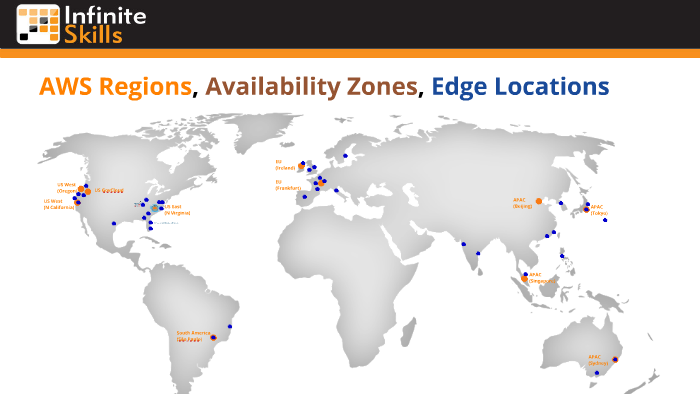  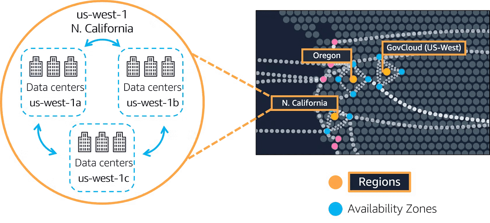

| Service | What is it? | Best Use Cases |
|-------|------------|---------------|
| **Availability Zone (AZ)** | One or more physically separate data centers within a region | High availability through redundant power, networking, and connectivity |
| **AWS Region** | A geographic area containing multiple Availability Zones | Fault isolation and regional resource deployment |
| **AWS Edge Locations** | Global points of presence for content delivery and security | Reduce latency, offload traffic from EC2, improve availability - CloudFront, Route 53, Global Accelerator, WAF, Shield |
| **AWS Local Zones** | Extension of an AWS Region that places compute, storage, database, and other select AWS services closer to large population, industry, and IT centers | Low-latency applications, data residency requirements - services such as EC2, Lambda, RDS, and S3 |

## Governance & Multi-Account Services

| Service | What is it? | Best Use Cases |
|-------|------------|---------------|
| **AWS Organizations**   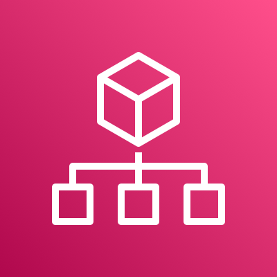 | Centralized multi-account management | Account structure, consolidated billing, SCP enforcement |
| **AWS Control Tower**    | Automated multi-account setup with best practices | Secure and compliant AWS environment at scale |
| **AWS Resource Access Manager (RAM)**    | Resource sharing across AWS accounts | Share VPC subnets, Transit Gateways, and other resources |
| **AWS Systems Manager – Session Manager**   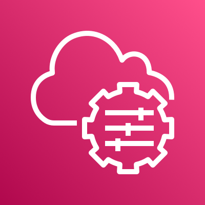 | Secure remote access to EC2 instances without SSH or RDP | Access EC2 securely using IAM, improve security posture, enable auditing without opening inbound ports |
| **AWS Systems Manager**    | Centralized operational management of AWS resources | Secure access to EC2 without SSH/RDP, patching, automation, auditing |

## Connectivity Services

| Service | What is it? | Best Use Cases |
|-------|------------|---------------|
| **AWS Direct Connect**    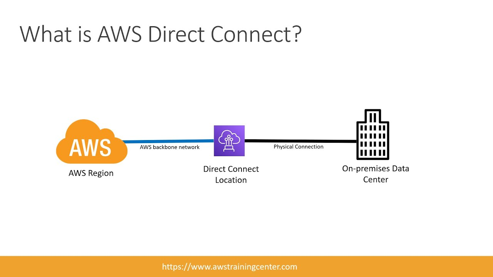 | Dedicated private network connection to AWS | High bandwidth, low latency, secure connections to AWS |
| **AWS VPN site-to-site**     | Encrypted connection over the internet to AWS | Secure connectivity for hybrid cloud architectures |
|**AWS Client VPN**    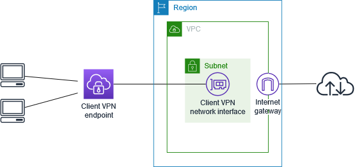 | Managed client-based VPN service | Secure remote access for users to AWS and on-premises networks |
| **AWS PrivateLink**    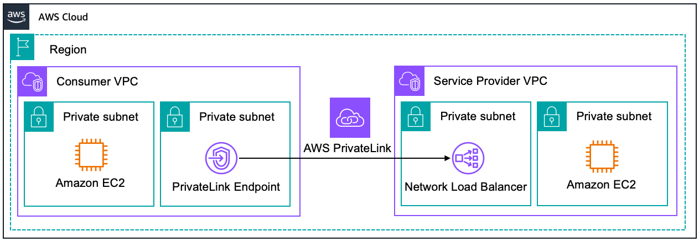 | Private connectivity to AWS services using VPC endpoints | Access AWS services without traversing the public internet |
|

## IAM Vs IAM Identity Center
| Service | What is it? | Best Use Cases |
|-------|------------|---------------|
| **AWS Identity and Access Management (IAM)**     | Manage users, roles, and permissions within AWS | Control access to AWS services using policies and roles |
| **AWS IAM Identity Center**     | Centralized identity management and single sign-on | Provide SSO access to multiple AWS accounts and applications , usually for enterprise environments |

## Networking Services
| Service | What is it? | Best Use Cases |
|-------|------------|---------------|
| **Amazon VPC**     | Isolated virtual network in AWS | Host web applications, multi-tier apps, secure environments |
| **Amazon Route 53**     | Scalable DNS and domain registration | Website routing, health checks, global traffic management |
| **Application Load Balancer (ALB)**    | Layer 7 load balancing within a region | Distribute traffic across targets in a single AWS Region |

## AWS Migration Tools

| Tool | What is it? | Best Use Cases |
|-----|------------|---------------|
| **AWS Database Migration Service (AWS DMS)**     | Managed service that migrates databases to AWS and replicates changes in real time while the source database remains operational. | - Database migrations - Continuous data changes - Minimal downtime - Gradual migrations |
| **AWS Application Migration Service (AWS MGN)**      | Service to migrate entire servers (OS + applications) to AWS by installing an agent on the source server. | - Full application migrations - No refactoring required - Physical servers or VMs - Fast migrations |

## AWS Database Services

| Database | Best For | SQL / NoSQL | Description |
|--------|---------|------------|-------------|
| **Amazon Aurora**     | High-traffic, mission-critical applications | **SQL** | Cloud-native relational database compatible with MySQL and PostgreSQL, optimized by AWS for performance and availability |
| **Amazon DynamoDB**     | Massive scale and serverless workloads | **NoSQL** (Key-Value / Document) | Fully managed NoSQL database with fast, predictable performance and automatic scaling |
| **Amazon RDS**     | Traditional applications | **SQL** | Managed relational database supporting MySQL, PostgreSQL, Oracle, SQL Server, and MariaDB |
| **Amazon Neptune**    | Complex relationships | **NoSQL (Graph)** | Graph database optimized for highly connected data |
| **Amazon Redshift**    | Analytics and BI | **OLAP** | Data warehouse designed for analytics, reporting, and big data workloads |
| **Amazon ElastiCache**    | Caching and in-memory data processing | **NoSQL (Key-Value / Document)** | In-memory data store for caching and real-time analytics; compatible with Redis and Memcached |
| **Amazon TimeStream**    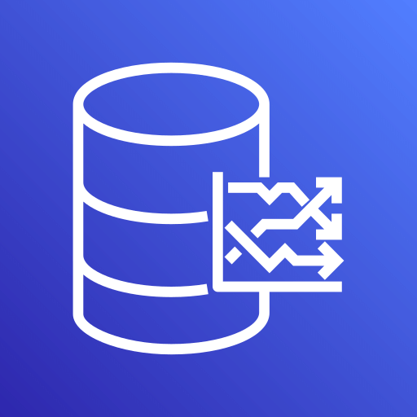| Time-series data | **NoSQL (Time-Series)** | Managed time-series database for IoT, DevOps, and real-time analytics |
| **AWS Quantum Ledger Database (QLDB)**    | Immutable and cryptographically verifiable ledger | **SQL** | Managed ledger database for applications requiring an immutable and verifiable record of transactions |

# AWS Storage Services

| Service | Purpose | How it Works | Pricing |
|-------|--------|-------------|--------|
| **Amazon S3**     | Object storage | Stores data as objects in buckets; scalable, durable, and accessible via HTTP | Pay as you go based on storage, requests, and data transfer |
| **Amazon S3 Glacier Deep Archive**  | Long-term archival | Stores data in archives with retrieval options (Standard, Expedited, Bulk) | Pay as you go based on storage, requests, and data transfer |
| **Amazon EBS**    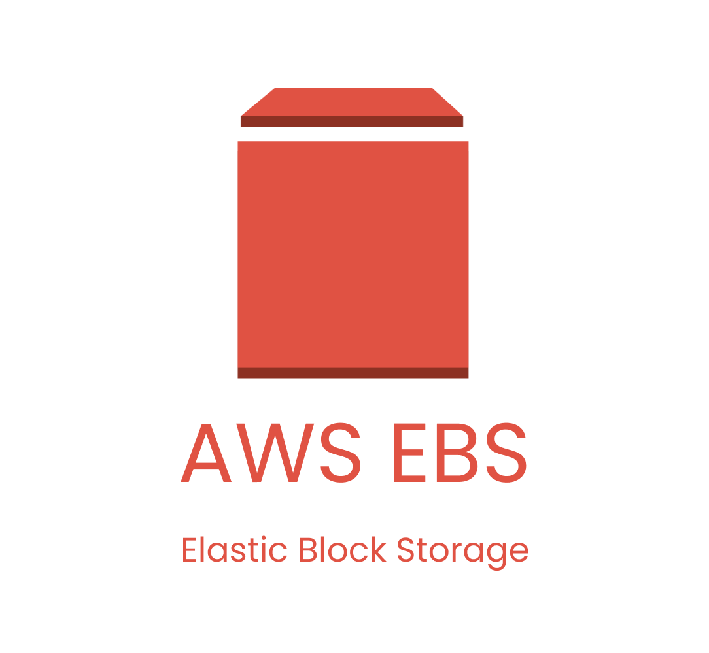 | Block storage for EC2 | Provides persistent block storage volumes for EC2 instances | Pay as you go based on volume type, size, and IOPS |
| **Amazon EFS**     | Scalable file storage | Provides scalable file storage accessible from multiple EC2 instances | Pay as you go based on storage used and throughput |
| **AWS Storage Gateway**    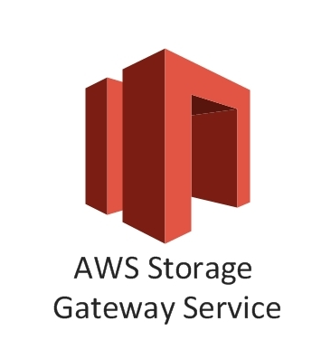 | Hybrid cloud storage | Connects on-premises environments to AWS cloud storage | Pay as you go based on gateway type, data transfer, and storage |
| **Amazon FSx for Lustre**    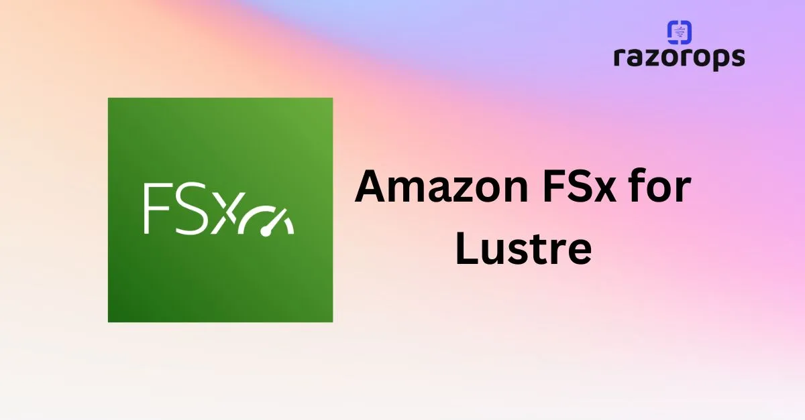 | High-performance file system | HPC, machine learning, and big data workloads with high throughput | | Pay as you go based on storage and throughput |
| **Amazon EBS multi-attach**     | Shared block storage for EC2 | Allows multiple EC2 instances to access a single EBS volume simultaneously | Pay as you go based on volume type, size, and IOPS |
## Security Controls

| Service | Purpose | How it Works | Pricing |
|-------|--------|-------------|--------|
| **Amazon GuardDuty**     | Detects threats in AWS accounts | Analyzes CloudTrail logs, VPC Flow Logs, and DNS logs to detect malicious activity (compromised credentials, malicious IPs, anomalous EC2 behavior) | Pay as you go based on logs analyzed |
| **AWS Artifact**     | Access compliance and audit documentation | Portal that provides audit reports, certifications, and compliance standards (ISO, GDPR, SOC) | Free (included with AWS account) |
| **AWS Shield**    | Protects against DDoS attacks | Automatically detects and mitigates DDoS attacks. Two levels: Standard and Advanced | Shield Standard: Free Shield Advanced: High fixed monthly cost |
| **AWS WAF**    | Web application firewall | Filters HTTP HTTPS traffic using rules to block SQL injection, XSS, and malicious requests | Pay as you go based on rules and requests inspected |
| **AWS Inspector**    | Vulnerability scanning | Scans EC2 instances, container images, and workloads for CVEs and insecure configurations | Pay as you go based on resources scanned |
| **AWS Security Hub**    | Centralized security view | Aggregates findings from GuardDuty, Inspector, Config, and others into a single dashboard | Pay as you go based on checks and findings |
| **AWS Trusted Advisor**     | Security recommendations | Provides best-practice recommendations but does not enforce controls | Included (basic checks free) |
| **AWS Marketplace**    | Third-party security tools | Marketplace to find and deploy third-party security software | Varies by vendor |

## Network Security Controls

| Control | Description |
|-------|-------------|
| **Network ACLs**    | Stateless, can explicitly deny traffic from IP ranges |
| **Security Groups**    | Stateful, cannot explicitly deny traffic; inbound traffic automatically allows outbound response |

## Access Control Services

| Service | Purpose | How it Works | Pricing |
|-------|--------|-------------|--------|
| **Amazon IAM**     | Manage access to AWS resources | Users, roles, policies, and permissions | Free |
| **AWS Cognito**    | User authentication | User directory, authentication, social login, temporary credentials | Pay as you go |
| **AWS Secrets Manager**    | Manage, rotate, and retrieve secrets | Database credentials, API keys, and other secrets throughout their lifecycle | Pay as you go |
| **AWS Key Management Service (AWS KMS)**    | Manage encryption keys | Create and manage encryption keys, rotate keys, and control access to keys | Pay as you go |

## Logging, Audit, and Monitoring

| Service | Purpose | How it Works | Pricing |
|-------|--------|-------------|--------|
| **Amazon CloudWatch**     | Monitor performance and health | Collects metrics, logs, alarms, dashboards, and sends alerts | Basic metrics free; logs, custom metrics, alarms pay as you go |
| **AWS CloudTrail**    | Track account activity | Records who did what, when, and from where; stores logs in S3; multi-region | Management events free; data events pay as you go |
| **AWS Config**     | Track configuration changes | Records resource configurations, detects changes, evaluates compliance | Pay as you go based on resources and rules |
| **AWS Audit Manager**    | Prepare audit evidence | Collects data from CloudTrail, Config, and other services; generates audit reports | Pay as you go based on assessments |

## Compute Services

| Service | Purpose | How it Works | Pricing |
|-------|--------|-------------|--------|
| **AWS Lambda**    | Serverless compute | Runs code in response to triggers (HTTP, schedules, AWS services); AWS handles scaling | Pay per request and compute time |
| **Amazon EC2**    | Virtual servers | Resizable compute capacity in the cloud | Pay per instance usage |
| **AWS Elastic Beanstalk**    | Managed app deployment | Upload code; AWS manages infrastructure, scaling, and monitoring | Pay only for underlying resources |
| **AWS Lightsail**    | Simple hosting | Preconfigured virtual servers with fixed pricing | Fixed monthly price |
| **AWS Outposts**    | Hybrid cloud | AWS infrastructure on-premises for low latency and data residency | Custom pricing |
| **AWS Systems Manager**    | Automate administrative tasks | Manage and automate EC2 instances, other AWS resources, and configurations | Pay as you go based on resources |

## EC2 Instance Types

| Type | Best For |
|----|---------|
| **General Purpose** | Balanced compute, memory, networking |
| **Compute Optimized** | CPU-intensive workloads (gaming, batch processing) |
| **Memory Optimized** | Large in-memory datasets, big data |
| **Storage Optimized** | High sequential read/write workloads |
| **Accelerated Computing** | GPU, ML, deep learning |
| **HPC Optimized** | High-performance computing |

## Container Services

| Service | Description | When to Use |
|-------|------------|------------|
| **Amazon ECS**    | AWS-native container orchestration | Stable workloads, tight AWS integration |
| **Amazon EKS**     | Managed Kubernetes | Complex workloads, portability, Kubernetes ecosystem |
| **Amazon ECR**    | Container registry | Store and manage Docker images |
| **AWS Fargate**     | Serverless containers | Run containers without managing servers |
| **EC2 Fleet**     | Manage EC2 capacity for containers | Optimize cost and availability for container workloads |

## EC2 Pricing Models
   
| Model | Description | Pros | Cons | Cost | When to Use |
|-----|-------------|------|------|------|------------|
| **On-Demand** | Pay per use, no commitment | Flexible | More expensive long-term | $$$ | Dev, testing, demos |
| **Reserved Instances** | 1 or 3-year commitment | Up to 72% savings | Long-term commitment | $ | Stable workloads |
| **Spot Instances** | Use unused AWS capacity | Up to 90% cheaper | Can be interrupted | $/2 | Batch, ML, big data |
| **Dedicated Host** | Physical server for one customer | Compliance | Very expensive | $$$$ | Licensing/legal needs |
| **Savings Plans** | Commit to $/hour usage | Flexible, cost savings | Commitment required | $ | EC2, Fargate, Lambdam, similar to  reserved Instances |

## Messaging & Events

| Service | Purpose | Key Characteristics |
|-------|--------|---------------------|
| **Amazon SQS**    | Message queue | Pull-based, messages stored, decouples applications |
| **Amazon SNS**    | Notifications | Push-based, pub/sub, messages not stored long-term |
| **Amazon EventBridge**    | Event bus | Event-driven architecture, system and business events |

## AWS Snow Family

| Service | Capacity | Typical Use |
|------|---------|-------------|
| **Snowcone**    | Up to 8 TB | Small-scale data transfer, edge computing |
| **Snowball**    | Tens of TBs to PBs | Large-scale offline data transfer |
| **Snowmobile**     | Exabytes | Extremely large data migrations |

## Amazon S3 Storage Classes
   

| Service | Description | Typical Use |
|------|-------------|-------------|
| **Amazon S3 Standard** | General-purpose object storage with high availability and durability | Frequently accessed data, web content, data lakes |
| **Amazon S3 Standard-IA** | Lower-cost storage for infrequently accessed data with millisecond retrieval | Backups, disaster recovery |
| **Amazon S3 Glacier Instant Retrieval** | Low-cost archival storage with instant access | Archive data that still needs fast access |
| **Amazon S3 Glacier Flexible Retrieval** | Archival storage with retrieval in minutes to hours | Archives accessed occasionally |
| **Amazon S3 Glacier Deep Archive** | Lowest-cost storage with very slow retrieval | Long-term retention, compliance data |
| **AWS Macie**    | Identify and protect sensitive data | Detects sensitive data, identifies risks, and provides insights 
## AI  Services (APIs and pretrained models)
| Service | Description | Typical Use |
|-------|------------|-------------|
| **Amazon Rekognition**    | Image and video analysis service | Object detection, facial recognition |
| **Amazon Lex**     | Conversational AI service | Build chatbots and voice assistants |
| **Amazon Polly**    | Text-to-speech service | Convert text to natural-sounding speech |
| **Amazon Translate**    | Language translation service | Translate text between languages |

## Machine Learning Services
| Service | Description | Typical Use |
|-------|------------|-------------|
| **Amazon SageMaker**    | End-to-end machine learning platform | Build, train, and deploy ML models at scale |
| **AWS Textract**    | Document analysis service | Extract text and data from scanned documents |
| **AWS Comprehend**    | Natural language processing service | Sentiment analysis, entity recognition |
| **AWS Kendra**    | Enterprise search service | Intelligent search across documents and data sources |
| **Amazon Transcribe**    | Automatic speech recognition service | Convert speech to text |

## Analytics Services
| Service | Description | Typical Use |
|-------|------------|-------------|
| **Amazon Athena**    | Serverless interactive query service | Analyze data in S3 using SQL |
| **Amazon EMR**    | Managed big data platform | Process large datasets using Hadoop, Spark |
| **Amazon Kinesis**    | Real-time data streaming service | Collect, process, and analyze streaming data |
| **AWS Glue**    | Managed ETL service | Prepare and transform data for analytics |
| **Amazon QuickSight**    | Business intelligence service | Create visualizations and dashboards |
| **Amazon OpenSearch Service**   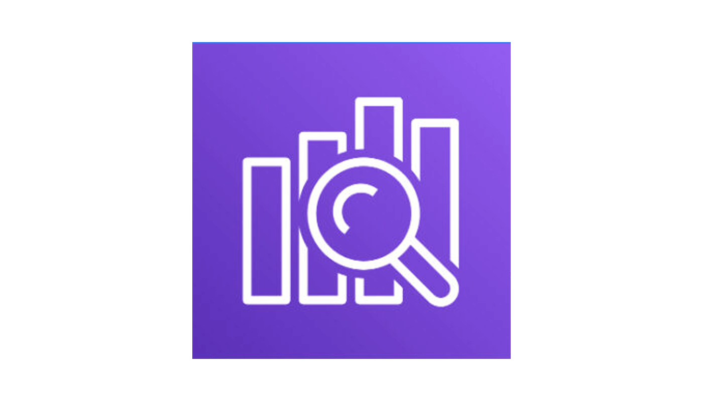 | Search and analytics engine | Full-text search, log analytics, real-time application monitoring |

### Observability and Monitoring
| Service | Description | Typical Use |
|-------|------------|-------------|
| **Amazon CloudWatch**    | Metrics, logs, and alarms for AWS resources and apps	 | Operational monitoring, alerting, dashboards|
| **Amazon CloudTrail**    | Audit log of API calls and account activity | Security, compliance, forensics (who did what and when)|
| **Amazon X-Ray**    | Distributed tracing and service maps	 | Performance debugging, bottleneck detection in microservices
 |

### Business Application Services (Customer Engagement)

A service that improves agility

| Service | Capacity | Typical Use |
|------|---------|-------------|
| **Amazon Connect**    | Cloud contact center | Customer service; Voice and chat |
| **Amazon Simple Email Service (Amazon SES)**    | Email sending Service|promotional, transactional, and marketing emails; From a custom domain; Inbound if configured| 

### AWS support

| Support Plan | Response Time (SLA) | Technical Guidance | Health Dashboard | 24/7 Support | TAM | Best For |
|-------------|-------------|-------------------|------------------|-------------|-----|-----|
| **Basic** | No SLA | Documentation & forums | Full | No | Shared (Pool) | All AWS customers |
| **Developer** | < 24 hours | Core checks | Basic | No (business hours) | No | Dev & test environments |
| **Business** | < 4 hours | Full checks | Enhanced | Yes | Dedicated | Production workloads |
| **Enterprise On-Ramp** | < 1 hour | Full checks | Enhanced | 24/7 | Shared TAM | Growing organizations |
| **Enterprise** | < 15 minutes | Core + proactive | Enhanced | 24/7 | Dedicated TAM | Mission-critical workloads |

### End User computing Services

| Service | Capacity | Typical Use |
|------|---------|-------------|
| **Amazon Workspaces**    | Fully managed virtual desktops for Windows and Linux | Provide users with cloud-based desktops (VDI)|
| **Amazon AppStream 2.0**    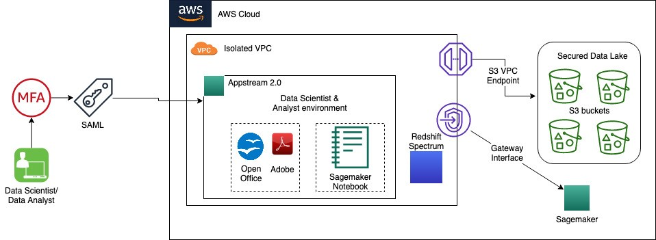| Streaming of applications|Access to specific apps| 
| **Amazon Workspaces Web**    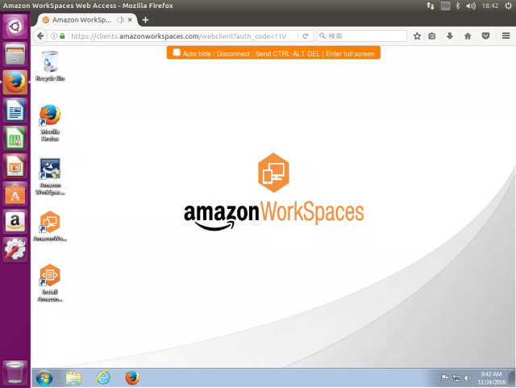| Access via web|Access internal websites and SaaS apps via a web browser| 

### Frontend web and mobile

| Service | Capacity | Typical Use |
|------|---------|-------------|
| **AWS Aplify**    | virtual escritorios for linux and windows | Build, deploy, and host web and mobile applications |
| **AWS AppSync**    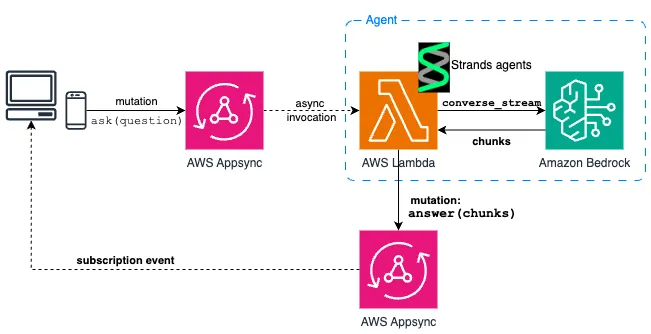| Managed GraphQL API service| Combine data from multiple sources (DynamoDB, Lambda, APIs) |

### IoT

| Service | Capacity | Typical Use |
|------|---------|-------------|
| **AWS IoT Core**    | Securely connect devices and ingest IoT data | Device-to-cloud secure communication |
| **AWS IoT Greegrass**    | Edge computing (local processing) | Process data locally, reduce latency, operate offline|

### Developer Services (DevOps)

| Service | Capacity | Typical Use |
|------|---------|-------------|
|**AWS CodeCommit**    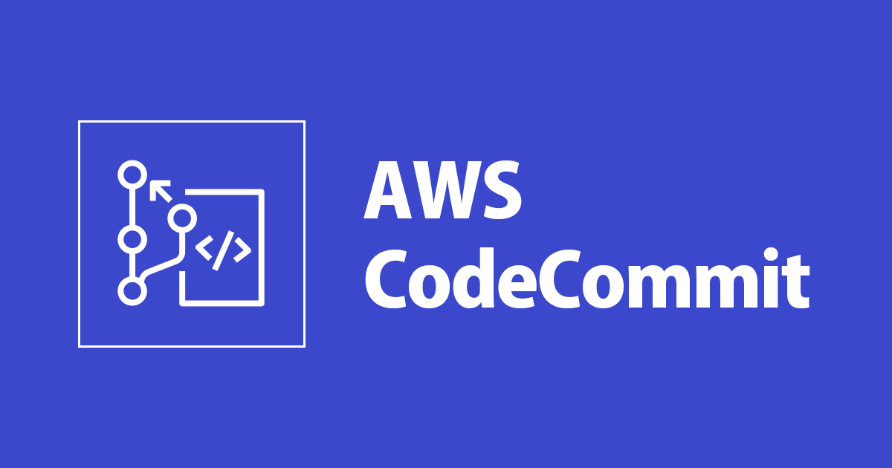| Fully managed Git-based source control | Store and manage source code repository |
|**AWS CodeBuild**    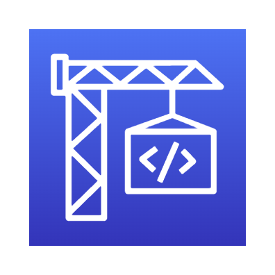| Fully managed Build Service | Compile code, run test, produce build artifact |
|**AWS CodeDeploy**    | Automated deployment service| Deploy applications to EC2, lambda or non premise |
|**AWS CodePipeline**    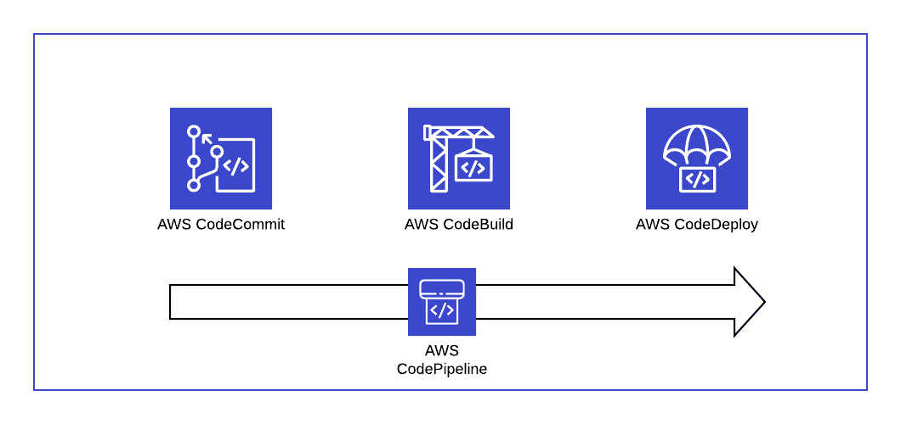| Continuous CI/CD orchestration| Automate build, test and deploy workflows |
|**AWS CodeStar**    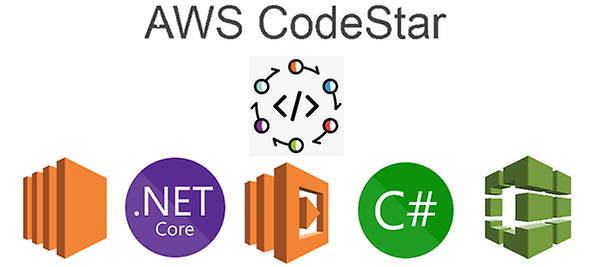| Unified DevOps project template| Quickly set up CI/CD projects |
|**AWS Cloud9**    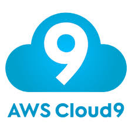| Cloud based IDE|Write, run, and debug code browser |
|**AWS CloudShell**    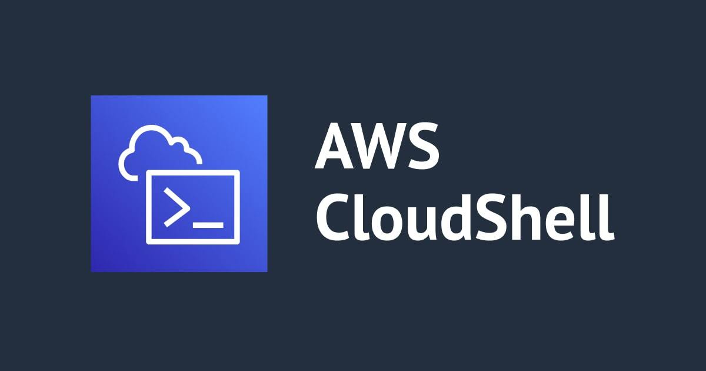| Browser based command line| Run AWS CLI without local set up |
